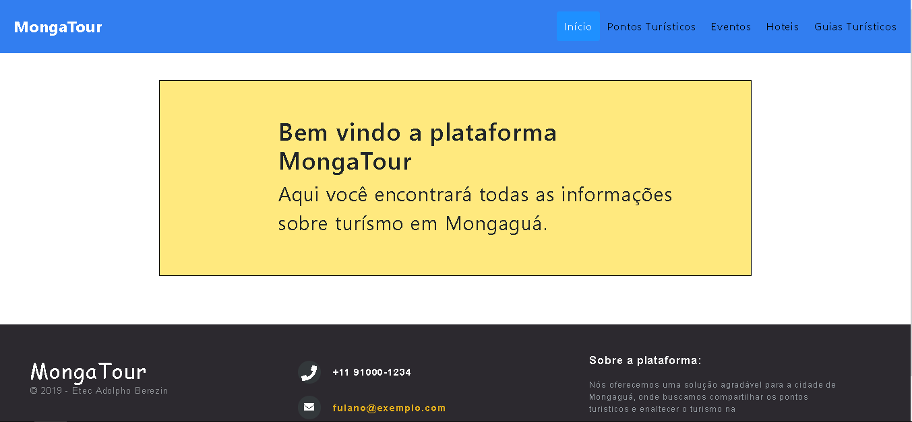

<h1 align="center">MongaTour (Re-Upload)</h1>

Repositório do projeto "MongaTour" ❤️, desenvolvido durante o Hackathon Etec Adolpho Berezin 2019/09

## 📜 Proposta

Criar um software com o tema de Turismo Ecológico para a cidade de Mongaguá.

## ⚡ Problema

Falta de incentivo do turismo ecológico na cidade de Mongaguá.

## 💡 Solução

* ⛱️ Criar uma plataforma que possa incentivar a valorização da cultura de Mongaguá.
* 📷 Permitir que usuários possam contratar serviços de guias de turismo especializados em Turismo Ecológico em Mongaguá.
* 💃 Divulgar eventos que estejam acontecendo na cidade.

## 📚 Conjunto de Funcionalidades

* Listagem dos principais pontos turísticos de Mongaguá.
* Cadastro, inserção e busca de novos eventos que estejam agendados ou que estão acontecendo em Mongaguá.
* Listagem dos hoteis disponíves, com um sistema de avaliação.
* Contratação de serviços de turismo ecológico.

## ✍️ Desenho da solução

  **MongaTour** é um projeto **descontinuado**, criado durante o Hackaton realizado na Etec Adolpho Berezin em setembro de 2019, com tema de "Turismo Ecológico" (Software 100% Livre).
  
  As atividades chaves que definem este projeto são a prestação de serviço, via publicidade de eventos e contratação de guias turísticos, e a divulgação dos pontos turísticos ecológicos de Mongaguá.
  
  Para que o site gere renda aos investidores, terá como objetivo o patrocínios de marcas, parceirias e anúncios.

## 📟 Tecnologias

* HTML
* CSS
* JAVASCRIPT

 <h4 align=center>Made with by <a target="_blank" href="https://github.com/LeoVanelli" >Leandro Vanelli</a></h4>
